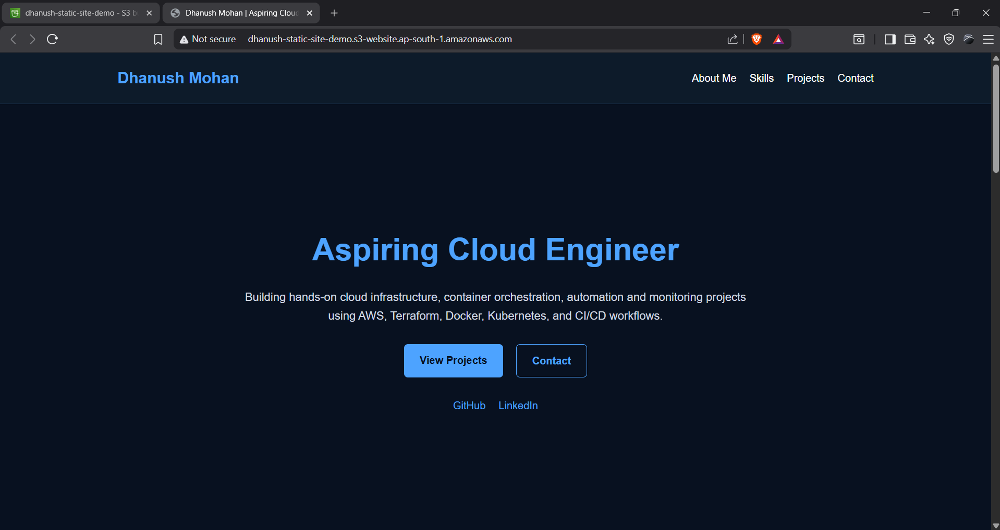
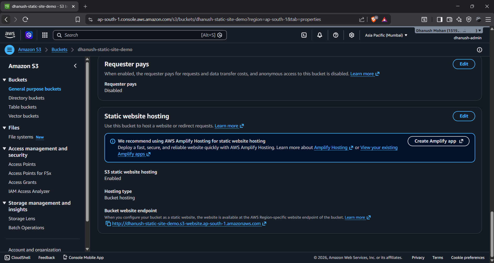
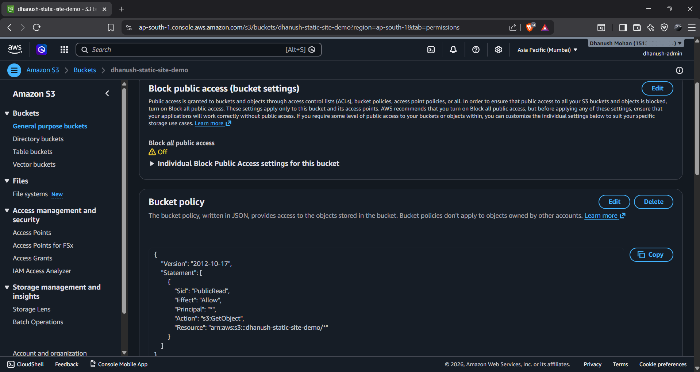
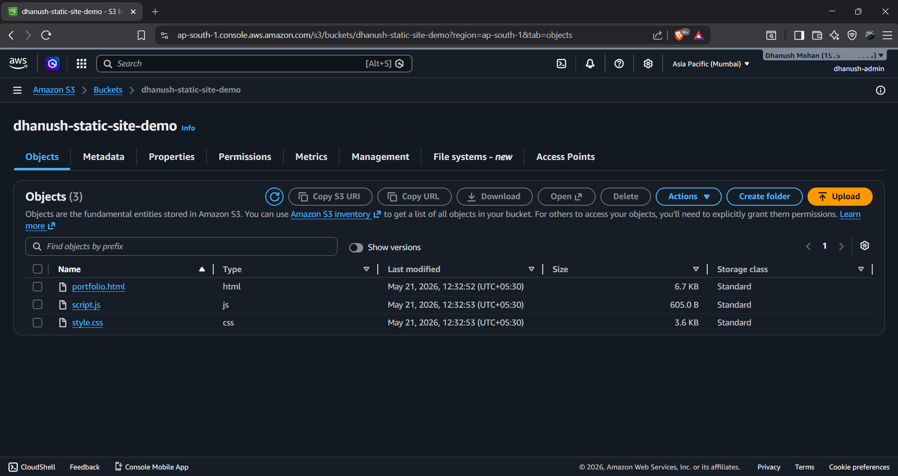

# AWS Static Portfolio Website

A static Portfolio website hosted using Amazon S3 static website hosting.

## AWS Services Used
- Amazon S3
- Permissions

## Features
- Static website hosting
- Responsive portfolio design
- Public content hosting using S3
- Permission and Policy based access configuration

## Project Architecture
User Browser → Amazon S3 Static Website Hosting

## Screenshots

### Portfolio Website

### Static Website Hosting

### Bucket Policy & Public Access

### Bucket Objects List

## Live Demo
http://dhanush-static-site-demo.s3-website.ap-south-1.amazonaws.com
